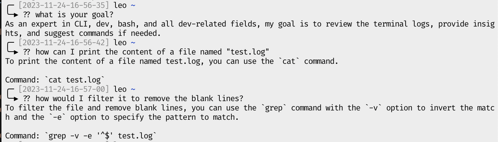

# GPT Terminal

This repository, named "GPT Terminal," is a tool that allows you to embed ChatGPT, a language model developed by OpenAI, into the Terminal. With this tool, you can interact with ChatGPT directly from your command line interface, enabling you to have conversational interactions with the model without the need for a separate application or interface. It provides a convenient way to access the capabilities of ChatGPT within your Terminal environment.This repository, named "GPT Terminal," is a tool that allows you to embed ChatGPT, a language model developed by OpenAI, into the Terminal. With this tool, you can interact with ChatGPT directly from your command line interface, enabling you to have conversational interactions with the model without the need for a separate application or interface. It provides a convenient way to access the capabilities of ChatGPT within your Terminal environment.

## How to use?

### Install

Add this at the end of your bash profile file:

```bash
function get_current_time {
    date '+%Y-%m-%d-%H-%M-%S'
}

if [[ -z "${SCRIPT}" ]]; then
    ( FILE_SCRIPT_LOG="/tmp/script_log_$(get_current_time).log" && \ 
      echo "Starting script with file ${FILE_SCRIPT_LOG}" && \
      script -t 5s -r $FILE_SCRIPT_LOG )
else
    echo "Running inside 'script' at ${SCRIPT}"
fi
```

Now, each time you start a bash session, its log and history will be saved in `/tmp/....log`.

Then run ` ln "/path/to/repo/GPT-terminal/gpt-terminal.py" "/usr/local/bin/??" `

Now you can just use 

```bash
$> ?? ask a question
```

in your terminal to get chatGPT's help.


